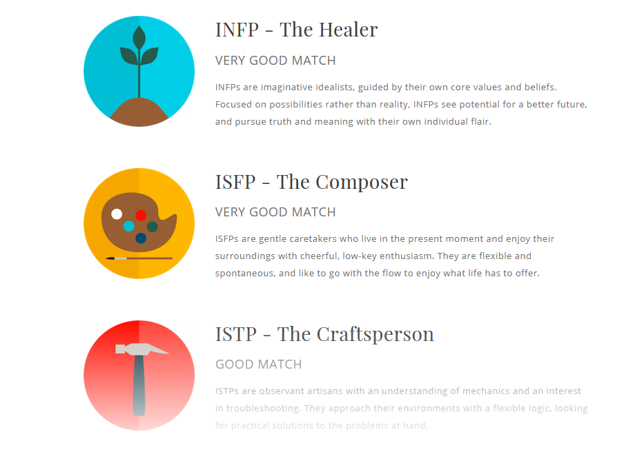

<<!DOCTYPE html>
<!--[if lt IE 7]>      <html class="no-js lt-ie9 lt-ie8 lt-ie7"> <![endif]-->
<!--[if IE 7]>         <html class="no-js lt-ie9 lt-ie8"> <![endif]-->
<!--[if IE 8]>         <html class="no-js lt-ie9"> <![endif]-->
<!--[if gt IE 8]><!--> <html class="no-js"> <!--<![endif]-->
  <head>
    <meta charset="utf-8">
    <meta http-equiv="X-UA-Compatible" content="IE=edge">
    <title></title>
    <meta name="description" content="">
    <meta name="viewport" content="width=device-width, initial-scale=1">
    <link rel="stylesheet" href="">
  </head>
  <body>
    <h1>1 – Personal Information </h1>
  
My name is Minh Hau TRUONG. My student number is S3859157. My email address is
    jerry.truong0609@yahoo.com. I’m from Vietnam and have lived 8 years in Australia. I married and got one boy who is 4
    months old. I finished the Advanced Diploma of Business Administration in 2012. Like almost the boys, when I was
    young that I used to play game a lot, spent almost my free time on my computer. Until now, I still play some games
    on my computer. Besides that, I like to read some technology news or watch videos about high-end products every day
    to update the knowledges of IT. Sometimes I spend money on those kinds of high-end products too.

    <h1>2 – Interest in IT </h1>
    
Spending most the time with my computer when I was young makes me feel more confidence about my knowledges
      because I can search and learn a lot such as study new language, look up new thing, watch videos on YouTube etc.
      As we all know the Internet is very huge and so many stuffs up there so it can satisfy so many needs of the users.
      Since the development of IT day by day, we have a lot of useful products right now which make your normal life
      more convenience. Compare to a mobile phone in 90s, now we have a lightweight, triple-sensor cameras, waterproof,
      under-screen sensors, tough screen and a lot of features which we can’t image IT can bring for us (Seven New
      Smartphone Features For 2019,2020). Furthermore, with the innovation of IT human now can create robots with
      artificial intelligence to help them assemble product faster, better and cheaper than normal labourers
      (Boutin,2020). Technology is never old because people are smart, so they invent many things to make life easier
      and convenience. That’ why technology is changing day by day. We can see that now so many millionaires are from IT
      industry. I can take it as reason or motivation that I like IT. After getting business degree in 2012, I tried go
      to work in business industry and I found out that kind of job doesn’t suit me. 

    
When I was in Vietnam, RMIT is the first and well-known international university. One of my dreams at that time
      was studying in that university. After I came to live in Australia, I knew that RMIT is one of the best
      universities here and especially RMIT is world leader in Computer Science and Information Systems. As result of
      the development in IT, RMIT now provides teaching online courses. It makes my dream fulfilled and happier with
      Information Technology course. 

    
At first, I struggled a bit about using RMIT website cause studying online is quite strange for me. I have no
      idea about lecture sessions, tutor sessions, learning materials, assignments etc. And so many things that make me
      confused. But after second week of studying, I feel better and more confident because all information I need is on
      the Canas. The online RMIT teaching team prepares everything necessary there for students. I hope I can catch up
      the class and collect knowledge that tutors teach as much as I can cause I’m 29 years old already. After finishing
      this degree, I can find a ideal job in IT segment.

    <h1>3 – Ideal Job </h1>
    
    
 

    <a
      href="https://www.seek.com.au/job/41089964?type=standout#searchRequestToken=63926a01-f280-423f-b77e-7d49069e4ac8">This
      is a link</a>
    
The company is looking for one innovative and motivated engineer for Senior Software position. It requires the
      candidate to work in a highly collaborative, team-based environment, also to think outside the box to find
      solutions for complex problems. The candidate for this position needs to lead other employees by providing
      technical guidance and contributing to company’s Young Professional programs. Working in this company, the role of
      candidate will provide the directions and motivate other team members in the company. This job will give the
      candidate a good pay and higher recognise in the organisation. 

    
To apply for this job the candidate should have experience working on Linux platforms. Besides that, the company
      requires these technology skills such as Python, Angular, Java, Typescript, ADA, Ansible, Open stack, Linux shell
      scripting, Jenkins, Dockers and Kubernetes, K8s, MySQL, MariaDB, Oracle and No-SQL database. Of course, the
      candidate doesn’t to know all of them. In order to eligible for this position, the candidate need to be Australian
      citizen and must have an active Australian Defence security clearance. 

    
I used to study Business Administration in the past so that I know about leadership and management skills that
      related some kinds of skills the candidate of this position need to know to manage the team members and also lead
      the young employees. And now I have started to learn about Java, Github and HTML.

    
To eligible for this position, now I need to master Java, HTML first by practising Java and HTML repeatedly,
      looking up the theories, watching Youtube related these subjects to learn and update new things. After I manage
      Java and HTML, I will plan to study other programmes like Python, JavaScript, Angular …. Besides that, the most
      important thing to apply for this position is Linux flatform, I will learn about it. Finally, learning from the
      experience IT will help me improve my skills and techniques. I will try to apply for some IT entry levels to study
      and collect the experiences. 

    <h1>4 – Personal Profile</h1>
    
Nowadays, so many employers use online tests such as Myers-Briggs Type Indicator test, learning style test, Big
      Five Personality test, a creativity test or psychometric test to collect specify information find the potential
      employees who will suit with their organisation.

    
The following information is results of: 

    <ul>
      <li>My online Myers-Briggs test </li>
      
      <li>My online learning style test</li>

      
 

      
      <li>My online Big Five Personality test</li>
      
 

      
    </ul>
    
After using these tests, now I can see my personality clearly than before via results. I can understand myself
      much more. It’s good to know my strengths and weaknesses. For the strengths, I will try to improve my value cores
      such as support, sensitivity, flexibly and loyalty. With the weaknesses I must face them and try to overcome them
      I need to accept my weaknesses to make myself better day by day. As we all know, it’s hard for everyone to accept
      their bad sides. That is a real challenge for everyone to improve themselves.

    
These online personality results may influence my behaviour in a team cause I’m kind of person not talk much to
      other people and keep problems by myself. But teamwork is completely different to individual work. The most
      important thing in a teamwork is the communication. With the communication all the team members will get to know
      each other better, understand the strengths and weaknesses of everyone so that the team leader can divide the
      tasks which each team member is good at to make a great outcome. Besides that, every teamwork always happens
      conflict between each team member so if everyone says their problems out to the others and the problems will be
      solved.

    
 For forming a team, I need to communicate more with the team. I will tell my team leader about myself more – my
      advantages and disadvantages so that the team can understand me. I think I will improve myself a lot if I work in
      a team. 

    <h1>5- Project Idea</h1>

    
Fighting to what we can see is easier than what we can’t. In the last decade, humanity has faced a lot of
      invisible viruses such as H1N1, H5N1, Ebola and right now we are facing the new coronavirus – COVID 19.
      Unfortunately, we haven’t had any vaccine for that kind of deadly virus yet. We can wash our hand with soap to
      kill the germs and prevent from the new coronavirus, but we can’t do it on the go or all the time. What if we can
      create a robot that is small enough to put in our pocket and kill the germs on our skin or any surfaces in our
      house by scanning with unharmful laser?

    
The technology is changing everyday with so many innovations that help our life easier. Now the people can create
      a packable robot that will scan your bed and rid it of the germs. The pocket-sized technology can sanitize and
      disinfect surfaces and is equipped with a UV-C light that is said to prevent the spread of airborne viruses. That
      robot can kill 99.99 percent of E. coli virus (This Packable Robot Will Scan Your Hotel Bed and Rid It of Germs,
      2020). So, we did make a packable robot like that right now. And this innovation is a premise for us to create a
      pocket-sized robot can scan and kill the virus with unharmful built-in laser.I’m going to name this project robot
      “GermsSlayer”. 

    
The GermsSlayer will be built-in with smart artificial intelligence sensors to keep the robot going on the right
      track and never get stuck in any corners of your house. With the smart artificial intelligence sensors,
      GermsSlayer will focuses on specifically for materials and fabrics and not simply hardwood or flat surfaces to
      gather and analyse all data and create the best artificial intelligence sensors for each types of surfaces. After
      analysing types of surfaces, GermsSlayer will scan your house in many directions to detect the germs even the one
      that flying on the air. GermsSlayer just takes a couple seconds of exposure to inactivate germ cells and kill them
      straight away by laser. After the first time running around your house, GermsSlayer is going to build their own 3D
      map of your house in their memory. GermsSlayer will run around your house like a robotic vacuum cleaner but in a
      different level, it can run over any surface without a doubt. After detecting the germs on any surfaces,
      GermsSlayer will launch a laser light to destroy them. With our innovation technology, GermsSlayer’s laser is safe
      for human and can kill the germ on the air or distance surfaces up to 2 meters. Under GermsSlayer, we built an eye
      in it with UV-C light to sanitize and disinfect any surface to kill any germs that it run over. That laser scan
      and UC-V light will be safe to your eyes and your children. We have researched and run many tests to make sure
      these lasers completely safe to the users and the environment. Another amazing feature of GermsSlayer is handheld
      mode, when you turn it into that mode so you can scan anything you want into your house such as toys, laptop,
      keyboard, mouse, glasses, mobile phone, tablet, bank cards… And another outstanding feature of GermsSlayer that
      makes it completely different to similar products is skin detection mode. When this mode is on, you can use it to
      scan your hand or your skin parts that usually contact to things which might contain germs on it such as hands,
      ears, nose, underarms …. And it’s safe to scan it on your skin. We have an app for you to set up on your mobile
      phone so whenever GermsSlayer detects a strong dangerous germ, it will alert you and you can send it to us to
      identify what kind of germ is. About the battery, like a robotic vacuum cleaner - GermsSlayer has its own charging
      station so it will go back to its station to charge when it runs of battery. For handheld mode, you can use
      GermsSlayer on the go up to 6 hours just with one charge. We designed and installed heat sinks in to GermsSlay so
      that it’s hard to get overheat. The GermsSlay is designed as a packable robot so it fits easily into your pocket
      and every suitcase. It’s light and easy to use. We will give you one year warranty for GermsSlayer. 

    
We need to know and research about the UV and laser technologies to kill the germs in just couple of seconds for
      the project. We need to make sure these ones safe with human. Researching about the artificial intelligence sensor
      technology detecting the germs and remembering the ways robot travels to build a 3D map. Skin scan mode technology
      is important to research to make project come true. 

    
Skill that we need to make this project possible:

        <ul>
          <li>Programming software.</li>
          <li>Technology design.</li>
          <li>Sensors.</li>
          <li>Networking. </li>
          <li>Electronics. </li>
        </ul>
        
Global warming is happening everywhere synonymous many new viruses will appear. So, if this project
          “GermsSlayer” is successful, we can reduce the illness or even the death of people from these new viruses
          which we haven’t created any vaccines against them yet. With this technology in our hand, each people can have
          their own packable “GermsSlayer “robot so we can avoid the germs. Furthermore, with this innovation that we
          use for these tiny robots so we can apply it for any public places such as hospitals, train stations,
          universities or airports etc.… to scan around and kill all the germs on the air. 

        <h2>References<h2>

            
Boutin, P., 2020. A Technological Revolution. [online] msnbc.com. Available at:<a
                href="http://www.nbcnews.com/id/6186351/ns/technology_and_science/t/technological-revolution/#.Xna5YnI7aUk">http://www.nbcnews.com/id/6186351/ns/technology_and_science/t/technological-revolution/#.Xna5YnI7aUk</a>
              [Accessed 20 March 2020].

            
Travel + Leisure. 2020. This Packable Robot Will Scan Your Hotel Bed And Rid It Of Germs. [online]
              Available at:<a
                href="https://www.telcoworld.com.au/news-blog/seven-new-smartphone-features-for-2019/">https://www.telcoworld.com.au/news-blog/seven-new-smartphone-features-for-2019/</a>
              [Accessed 21 March 2020].

            
Telcoworld.com.au. 2020. Seven New Smartphone Features For 2019 - Telcoworld Corp. Melbourne Mobile Phone
              Repairs. [online] Available at:<a
                href="https://www.travelandleisure.com/travel-news/cleanse-bot-kills-germs-hotel-rooms">https://www.travelandleisure.com/travel-news/cleanse-bot-kills-germs-hotel-rooms</a>
              [Accessed 20 March 2020].

    
    
  </body>
</html>

